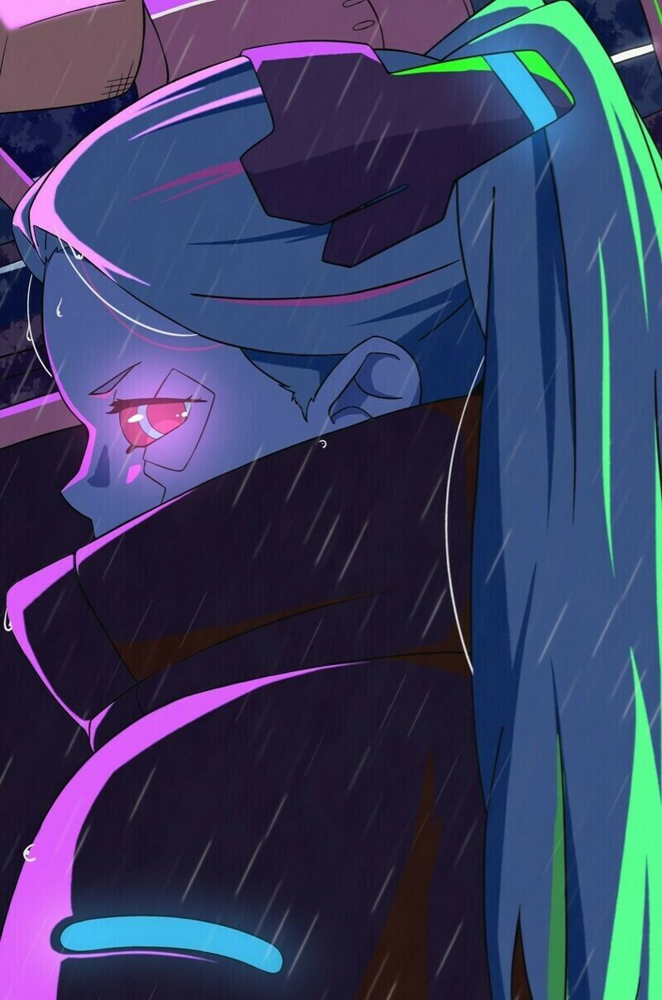

<h1><b>Bugeun Choi</b></h1>

Vulnerability Researcher

&nbsp;

## ABOUT ME

I aspire to be the world's best in vulnerability research and exploit develop within the field of software engineering.

&nbsp;

<!--
## Interests
>
* <b>Vulnerability Research & Exploit Dev</b> <small>1-day / 0-day</small>
* <b>CTF/Wargame</b> <small>System Hacking / Binary Analysis / Web</small>
* <b>Analysis tool Development</b>
* <b>Computer Science</b>

&nbsp; 
-->

## Interests
<section>
        <ul>
          <li>
          <b>Security Skill</b>
          <small>System Hacking / Binary Analysis / Web</small>
          </li>
          <li>
          <b>Research</b> 
          <small>N-day Analysis / 0-day Hunting / Exploit Dev</small>
          </li>
          <li>
          <b>Programming</b>
          <small>C,C++ / Assembly / Python / Web</small>
          </li>
          <li>
          <b>Computer Science</b>
          </li>
        </ul>
</section>

&nbsp;

<!--
<section>
        <ul>
          <li>
            <b>Programming</b> 
            <small>C/C++, Assembly, Web, Python</small>
          </li>
        </ul>
</section>
-->

## EDUCATION
  

<b>[2020 - 2023] Seoul Arts University</b>

Major in Applied Music
     

<b>[2013 - 2014] KITRI Best of the Best 2th</b>

Vulnerability Analysis Track

&nbsp;

## EXPERIENCE

<b>[2024.04 - Till now] SK Shieldus | </b> Senior Researcher

&nbsp;

## VULNERABILITY REPORTS

<b>[2013] OCS (Order Communication System) at a Major Hospital in Changwon</b>

&nbsp;

## ACHIEVEMENTS

<b>[2025] Pwn2Own Automotive Tokyo 2025</b> <small> Win a prize (Team SK Shieldus) </small>

<b>[2024] 6th, Block Harbor VicOne Automotive CTF - Season 2</b> <small> (Team a99) </small>

<b>[2023] 11th, CakeCTF 2024</b> <small> (Team PhysicalLAB) </small>

<b>[2013] 5th, White Hat Contest</b>

<b>[2013] 11th, Codegate 2013 Final</b> <small>(Team ForbiddenBITS)</small>

<b>[2013] 8th, PHdays CTF Final</b> <small>(Team ForbiddenBITS)</small>

<b>[2012] 8th, Nuit du Hack CTF</b> <small>(Team ForbiddenBITS)</small>

<b>[2012] President's Award</b> <small>Korea Internet &amp; Security Agency Cyber Attack Scenario Contest</small>

&nbsp;
